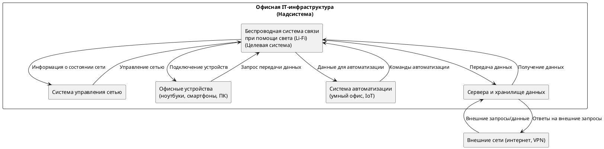

# Основы теории систем и системного анализа

## Сделать разработку для своей системы:

## 1. Нарисовать контекстную диаграмму, на которой можно увидеть деятельность в надсистеме, целевую систему, элементы системы, взаимосвязи с другими системами для выполнения производственного процесса (процесса деятельности) в надсистеме. Дать текстовое описание для контекстной диаграммы. 

### PlantUML код диаграммы:

### Описание контекстной диаграммы:

#### 1. **Надсистема: Офисная IT-инфраструктура**
   Это надсистема, в рамках которой функционирует беспроводная система связи (Li-Fi). IT-инфраструктура включает оборудование и программные решения, которые обеспечивают связь, передачу данных и автоматизацию процессов в офисе. Ключевые компоненты надсистемы: офисные устройства, система управления сетью, сервера и система автоматизации (умный офис).

#### 2. **Беспроводная система связи при помощи света (Li-Fi)**
   Li-Fi — это система, отвечающая за беспроводную передачу данных с использованием света. Она обеспечивает подключение офисных устройств, передачу данных к серверам и поддерживает взаимодействие с другими системами, такими как система автоматизации.

#### 3. **Элементы системы и их функции:**
   - **Офисные устройства (ноутбуки, смартфоны, ПК)**: Устройства сотрудников подключаются к Li-Fi для получения доступа к корпоративной сети и ресурсам.
   - **Сервера и хранилище данных**: Сервера обрабатывают и хранят данные, поступающие через Li-Fi. Взаимодействие между устройствами и серверами обеспечивает передачу данных.
   - **Система управления сетью**: Эта система управляет сетью Li-Fi, контролирует ее работу и распределяет ресурсы.
   - **Система автоматизации (умный офис, IoT)**: Устройства автоматизации (например, датчики или системы управления освещением) подключены через Li-Fi и обмениваются данными для обеспечения автоматизации процессов (управление светом, климатом, безопасностью).

#### 4. **Процесс деятельности:**
   - **Подключение устройств**: Офисные устройства подключаются к сети через Li-Fi для беспроводной передачи данных.
   - **Передача данных**: Данные от устройств передаются через Li-Fi к серверам или другим устройствам, обеспечивая связь и обмен информацией внутри офиса и с внешними сетями.
   - **Управление сетью**: Система управления сетью контролирует работу Li-Fi, оптимизируя ее производительность и мониторинг состояния.
   - **Автоматизация процессов**: Устройства системы автоматизации (умный офис) получают команды и данные через Li-Fi, что позволяет автоматизировать управление освещением, климатом и другими процессами в офисе.

#### 5. **Взаимосвязи с внешними системами:**
   - **Внешние сети (интернет, VPN)**: Система Li-Fi взаимодействует с внешними сетями через офисные сервера. Это позволяет офисным устройствам подключаться к интернету, внешним сервисам и системам через VPN.

## 2. Сформулировать цели и задачи деятельности в надсистеме. Выполнить анализ и описать процессы деятельности в надсистеме (системе уровня предприятия), где люди применяют инженерные системы для достижения поставленных целей. Декомпозировать процессы деятельности в надсистеме на шаги. Задать целевые показатели результативности процесса. Предложить альтернативные варианты автоматизации процесса деятельности в надсистеме.

#### Цели надсистемы:
- **Обеспечение бесперебойного и быстрого обмена данными** между сотрудниками офиса с минимальной задержкой и высокой пропускной способностью.
- **Повышение производительности и эффективности работы сотрудников** за счет автоматизации и улучшения инженерных систем.
- **Оптимизация ресурсов сети** и снижение затрат на управление инфраструктурой.
- **Повышение уровня безопасности** данных, передаваемых внутри корпоративной сети, и снижение риска утечек информации.
  
#### Задачи надсистемы:
- Поддержка стабильного и быстрого беспроводного подключения для офисных устройств (ноутбуки, ПК, смартфоны).
- Интеграция с системами автоматизации (умный офис), такими как управление освещением, климат-контроль, управление доступом.
- Управление сетью с помощью системы мониторинга, обеспечивающей безопасность и эффективность передачи данных.
- Обеспечение взаимодействия с внешними сетями (интернет, VPN) для доступа к глобальным ресурсам.

### **Анализ и описание процессов деятельности в надсистеме**

#### Ключевые процессы:
1. **Подключение устройств к сети:**
   - Офисные устройства (ПК, ноутбуки, смартфоны) подключаются к сети через Li-Fi или Wi-Fi.
   - Сеть распределяет IP-адреса и проверяет аутентификацию пользователей.
   
2. **Передача данных:**
   - Сотрудники обмениваются данными внутри корпоративной сети (файлы, электронная почта, видеоконференции).
   - Данные передаются между устройствами через Li-Fi с высокой скоростью и низкой задержкой.

3. **Автоматизация офисных процессов:**
   - Умные системы (IoT-устройства, сенсоры) собирают данные и отправляют команды через сеть для автоматизации процессов (освещение, управление температурой).
   - Система контролирует различные параметры окружающей среды в реальном времени.

4. **Управление и мониторинг сети:**
   - Система управления сетью отслеживает состояние соединений, перегрузки, наличие угроз безопасности.
   - В случае отклонений автоматически применяются меры по исправлению (например, перераспределение пропускной способности).

5. **Взаимодействие с внешними сетями:**
   - Система поддерживает VPN-подключения для удаленных сотрудников.
   - Внешний доступ через интернет и взаимодействие с внешними ресурсами для решения бизнес-задач.

### **Декомпозиция процессов деятельности в надсистеме на шаги**

Декомпозиция процесса **подключения устройств к сети**:

1. Пользователь включает устройство (ноутбук, ПК).
2. Устройство сканирует доступные беспроводные сети.
3. Выбор сети Li-Fi или Wi-Fi.
4. Ввод данных для аутентификации (логин, пароль).
5. Система управления сетью проверяет учетные данные и предоставляет доступ.
6. Устройство подключается к сети, получая IP-адрес.
7. Начинается передача данных через сеть (доступ к корпоративным ресурсам).

Декомпозиция процесса **автоматизации офисных процессов**:

1. Сенсоры (датчики движения, температуры) передают данные в систему автоматизации.
2. Данные анализируются системой управления.
3. В зависимости от показаний, система передает команды на изменение параметров (освещение, климат).
4. Исполнительные устройства (освещение, климат-контроль) изменяют свои настройки в реальном времени.
5. Система мониторит выполнение команд и отправляет отчеты.

### **Целевые показатели результативности процесса** ?? найти ссылки

#### Для процесса **подключения устройств**:
- Время подключения устройства к сети: < 10 секунд.
- Процент успешных подключений: > 99%.
- Пропускная способность сети: > 1 Гбит/с для каждого устройства.
- Уровень безопасности (количество попыток взлома/неавторизованных подключений): 0.

#### Для процесса **передачи данных**:
- Средняя задержка передачи данных: < 5 мс.
- Потери пакетов при передаче данных: < 1%.
- Энергопотребление системы связи: снижение на 15% по сравнению с Wi-Fi.

#### Для процесса **автоматизации офисных процессов**:
- Время реакции на команды (автоматизация освещения, климат-контроль): < 2 секунды.
- Снижение затрат на электроэнергию: на 10% благодаря автоматизации.
- Доля ошибок в автоматизации: < 0,1%.

### **Альтернативные варианты автоматизации процессов деятельности** ?? тут wifi должен быть

1. **Автоматизация через Li-Fi и IoT-системы:**
   - Использование сенсоров и умных устройств, передающих данные через Li-Fi для улучшения скорости и безопасности. Все процессы автоматизируются и контролируются через сеть.

2. **Использование AI для прогнозирования и автоматизации:**
   - Внедрение систем искусственного интеллекта для анализа данных и предсказания потребностей в сети, автоматизации офисных процессов на основе поведения сотрудников и внешних условий (например, автоматическая настройка освещения в зависимости от количества людей в помещении).

3. **Автоматизация через облачные решения:**
   - Перенос управления сетью и автоматизации процессов в облако. Это позволит централизованно управлять офисными процессами и данными, что облегчит управление сетью для распределённых офисов.

## 3. Сформулировать назначение системы таким образом, чтобы оно было связано с задачами деятельности в надсистеме, явным образом обозначить эту связь. 

### Назначение системы "Беспроводная система связи при помощи света (Li-Fi)"

**Назначение системы:**  
Беспроводная система связи при помощи света (Li-Fi) предназначена для обеспечения высокоскоростной и безопасной передачи данных в офисной IT-инфраструктуре, способствуя эффективному подключению устройств, передаче данных и автоматизации офисных процессов. Система Li-Fi интегрируется в общую архитектуру офисной IT-инфраструктуры, способствуя выполнению следующих задач:

1. **Подключение устройств**:
   - **Связь:** Li-Fi обеспечивает надежное и быстрое подключение офисных устройств (ноутбуков, ПК, смартфонов) к сети, позволяя пользователям подключаться за считанные секунды. Это соответствует задаче поддержания стабильной и быстрой беспроводной связи в офисной среде.

2. **Передача данных**:
   - **Связь:** Система Li-Fi позволяет осуществлять обмен данными между устройствами с высокой пропускной способностью и минимальной задержкой. Это поддерживает задачу повышения производительности и эффективности работы сотрудников, предоставляя быстрый доступ к корпоративным ресурсам.

3. **Управление сетью**:
   - **Связь:** Интеграция системы Li-Fi с системами управления сетью обеспечивает мониторинг состояния сети и автоматическое исправление возможных проблем, что соответствует задаче оптимизации ресурсов сети и управления инфраструктурой.

4. **Автоматизация офисных процессов**:
   - **Связь:** Li-Fi обеспечивает взаимодействие с IoT-устройствами для автоматизации процессов в офисе (например, управление освещением, климат-контроль). Это связано с задачей автоматизации и повышения уровня комфорта сотрудников, а также улучшения общей эффективности работы офиса.

5. **Повышение уровня безопасности**:
   - **Связь:** Благодаря использованию световых волн для передачи данных, Li-Fi обеспечивает защиту от несанкционированного доступа, так как сигнал не может выйти за пределы помещения. Это поддерживает задачу повышения уровня безопасности данных и снижения риска утечек информации.

## 4. Задать показатели результативности системы в виде дерева (MOE, MOP, MOS), Провести свой собственный анализ предметной области и выбрать для своей системы несколько показателей из списка (если не подходят показатели/свойства из книги, либо помимо них): Usability, Single-Use/Multi-use Applications, Comfort, Interoperability, Transportability, Mobility, Maneuverability, Portability, Growth and Expansion, Reliability, Availability, Maintainability, Producibility, Mission Support, Deployment, Training, Vulnerability, Lethality,Survivability, Security and Protection, Efficiency, Effectiveness, Reconfigurability, Integration, test, and evaluation, Verification, Disposal, Safety. Дать методику измерений каждого из показателей. Добавить другие показатели

Для системы "Беспроводная система связи при помощи света (Li-Fi)" выберем несколько ключевых показателей результативности и проанализируем их. Каждый показатель будет описан с указанием его важности, метода измерения и других параметров.

### Таблица показателей результативности системы

| **Показатель**          | **Описание**                                                                 | **Степень важности** | **Метод измерения**                     | **Единицы измерения** | **Входные данные**                          | **Выходные данные**               | **Функция оценки**                            | **Отсылка к источнику**               |
|-------------------------|------------------------------------------------------------------------------|----------------------|-----------------------------------------|-----------------------|---------------------------------------------|------------------------------------|------------------------------------------------|---------------------------------------|
| **Usability**           | Удобство использования системы для пользователей.                           | Высокая              | Анкетирование пользователей             | Оценка по шкале 1-10  | Отзывы пользователей                       | Общая оценка удобства             | Среднее значение оценок пользователей         | [1] ISO 9241                                   |
| **Reliability**         | Надежность системы в обеспечении стабильного соединения.                   | Высокая              | Статистика сбоев и ошибок              | Процент               | Журнал ошибок и сбоев                     | Процент надежности                | (Количество успешных соединений / Общее количество) * 100 | [2]    IEEE 1633                                |
| **Availability**        | Доступность системы для пользователей.                                      | Высокая              | Мониторинг времени работы               | Процент               | Записи о времени работы системы           | Процент доступности               | (Время работы / Общее время) * 100            | [3]                                    |
| **Security and Protection** | Способность системы защищать данные и предотвратить несанкционированный доступ. | Критическая              | Тестирование на уязвимости              | Оценка по шкале 1-10  | Отчеты о тестах безопасности              | Общая оценка безопасности         | Среднее значение оценок безопасности           | [4]   NIST SP 800-53                                 |
| **Efficiency**          | Эффективность передачи данных в системе.                                    | Средняя              | Измерение времени передачи данных       | Мбит/с                | Объем передаваемых данных, время передачи  | Скорость передачи данных           | Объем переданных данных / Время передачи       | [5] ISO 50001                                   |
| **Maintainability**     | Простота обслуживания и обновления системы.                                 | Средняя              | Время на обслуживание                   | Часы                  | Записи о техническом обслуживании        | Среднее время на обслуживание      | Общее время обслуживания / Количество обслуживания | [6]  ISO 14764                                  |
| **Portability**                | Возможность использования системы в различных условиях.       | Средняя               | Тестирование в разных условиях   | Баллы (1-10)        | Данные о средах использования, характеристиках  | Уровень портативности, описание условий    | Оценка по результатам тестов            | IEEE 828 |

1. **Usability (Удобство использования)**:
   - **Описание**: Оценивает, насколько легко и интуитивно пользователи могут взаимодействовать с системой. Включает в себя доступность функций и простоту навигации.
   - **Степень важности**: Высокая, так как сложный интерфейс может снизить эффективность работы и вызвать недовольство пользователей.

2. **Reliability (Надежность)**:
   - **Описание**: Измеряет способность системы предоставлять стабильные и предсказуемые результаты. Включает частоту сбоев и время безотказной работы.
   - **Степень важности**: Высокая, так как частые сбои могут негативно повлиять на продуктивность и доверие пользователей.

3. **Availability**: Высокая доступность системы гарантирует, что пользователи смогут подключаться к сети в любое время.

4. **Security and Protection (Безопасность и защита)**:
   - **Описание**: Оценивает уровень защиты данных и безопасность сети. Включает в себя защиту от внешних и внутренних угроз.
   - **Степень важности**: Высокая, так как недостаточная безопасность может привести к утечке данных и нарушению работы системы.

5. **Efficiency (Эффективность)**:
   - **Описание**: Оценивает, как эффективно система использует ресурсы, включая энергию и данные, для выполнения задач.
   - **Степень важности**: Средняя, так как оптимизация ресурсов может сократить затраты и увеличить производительность.

6. **Maintainability (Поддерживаемость)**:
   - **Описание**: Измеряет легкость, с которой система может быть обслужена и обновлена. Включает в себя время и усилия, необходимые для выполнения технического обслуживания.
   - **Степень важности**: Средняя, так как легкость обслуживания может влиять на общую стоимость владения системой.

7. **Portability (Портативность)**:
   - **Описание**: Оценивает способность системы работать в различных средах и условиях. Включает в себя возможность использования в разных офисах и при разных источниках света.
   - **Степень важности**: Средняя, так как гибкость системы может улучшить ее привлекательность для различных пользователей и условий.

### Отсылки к источникам

- [1] Nielsen, J. (1993). Usability Engineering.
- [2] Avizienis, A., Laprie, J.C., Randell, B., & Landwehr, C. (2004). Basic Concepts and Taxonomy of Dependable and Secure Computing.
- [3] Hwang, K., & Briggs, F. (1992). Computer Availability and Reliability.
- [4] Anderson, R. (2020). Security Engineering: A Guide to Building Dependable Distributed Systems.
- [5] Tanenbaum, A.S., & Wetherall, D.J. (2011). Computer Networking.
- [6] Clements, P., & Northrop, L. (2001). Software Product Lines: Practices and Patterns.

## 5. Оформить в виде таблицы трассировку «цель деятельности в надсистеме по SMART – показатели результативности в процессе деятельности надсистемы – назначение системы – показатели результативности системы». Сделать по примеру

Для оформления трассировки «цель деятельности в надсистеме по SMART – показатели результативности в процессе деятельности надсистемы – назначение системы – показатели результативности системы» в виде таблицы, можно использовать следующий формат:

| **Цель деятельности в надсистеме (по SMART)**                                         | **Показатели результативности в процессе деятельности надсистемы**                         | **Назначение системы**                                                               | **Показатели результативности системы**                                            |
|-----------------------------------------------------------------------------------------|------------------------------------------------------------------------------------------|-------------------------------------------------------------------------------------|-------------------------------------------------------------------------------------|
| **Обеспечение высокоскоростного и безопасного обмена данными**                      | - Средняя скорость передачи данных > 1 Гбит/с                                          | Обеспечение надежной и быстрой передачи данных в офисной IT-инфраструктуре         | - Эффективность: высокая скорость передачи данных и минимальная задержка           |
|                                                                                         | - Средняя задержка < 5 мс                                                               |                                                                                     |                                                                                     |
|                                                                                         | - Процент успешных подключений > 99%                                                   |                                                                                     |                                                                                     |
| **Оптимизация ресурсов сети и снижение затрат на управление инфраструктурой**         | - Процент времени доступности системы > 99%                                            | Обеспечение эффективного управления сетью с минимальными затратами                  | - Доступность: высокая доступность системы для пользователей                       |
|                                                                                         | - Количество успешных соединений с IoT-устройствами                                      |                                                                                     |                                                                                     |
| **Повышение уровня безопасности данных**                                              | - Количество попыток взлома/неавторизованных подключений = 0                           | Защита передаваемых данных от несанкционированного доступа                          | - Надежность: высокая вероятность функционирования системы без сбоев                |
| **Автоматизация процессов в офисе**                                                  | - Время реакции на команды < 2 секунды                                                 | Интеграция с IoT-устройствами для автоматизации процессов                           | - Удобство использования: легкость подключения и использования системы              |
|                                                                                         | - Процент успешного выполнения автоматизированных процессов > 95%                        |                                                                                     |                                                                                     |
| **Повышение комфорта работы сотрудников**                                            | - Уровень удовлетворенности пользователей > 80%                                        | Создание комфортной рабочей среды через автоматизацию и управление климатом          | - Совместимость: способность взаимодействия с другими системами и устройствами     |