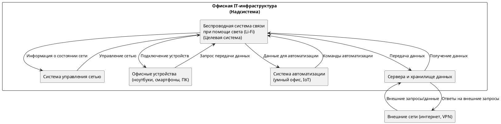
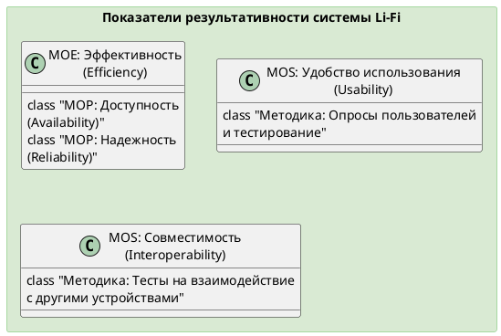
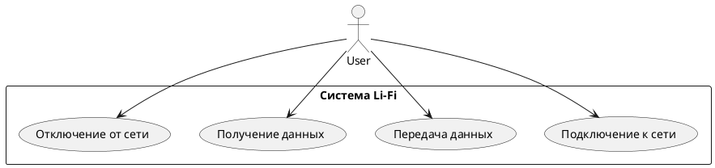
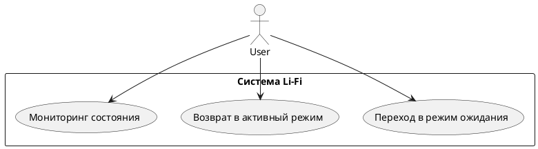
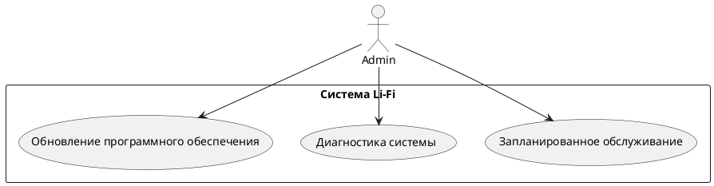
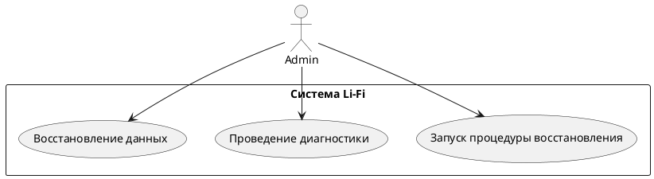
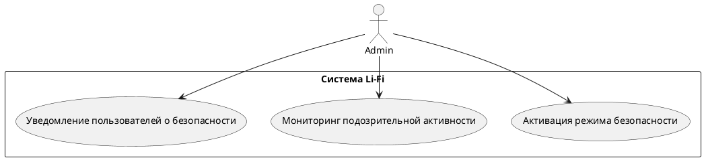

# Основы теории систем и системного анализа

## Сделать разработку для своей системы:

## 1. Нарисовать контекстную диаграмму, на которой можно увидеть деятельность в надсистеме, целевую систему, элементы системы, взаимосвязи с другими системами для выполнения производственного процесса (процесса деятельности) в надсистеме. Дать текстовое описание для контекстной диаграммы. 

### PlantUML код диаграммы:

### Описание контекстной диаграммы:

#### 1. **Надсистема: Офисная IT-инфраструктура**
   Это надсистема, в рамках которой функционирует беспроводная система связи (Li-Fi). IT-инфраструктура включает оборудование и программные решения, которые обеспечивают связь, передачу данных и автоматизацию процессов в офисе. Ключевые компоненты надсистемы: офисные устройства, система управления сетью, сервера и система автоматизации (умный офис).

#### 2. **Беспроводная система связи при помощи света (Li-Fi)**
   Li-Fi — это система, отвечающая за беспроводную передачу данных с использованием света. Она обеспечивает подключение офисных устройств, передачу данных к серверам и поддерживает взаимодействие с другими системами, такими как система автоматизации.

#### 3. **Элементы системы и их функции:**
   - **Офисные устройства (ноутбуки, смартфоны, ПК)**: Устройства сотрудников подключаются к Li-Fi для получения доступа к корпоративной сети и ресурсам.
   - **Сервера и хранилище данных**: Сервера обрабатывают и хранят данные, поступающие через Li-Fi. Взаимодействие между устройствами и серверами обеспечивает передачу данных.
   - **Система управления сетью**: Эта система управляет сетью Li-Fi, контролирует ее работу и распределяет ресурсы.
   - **Система автоматизации (умный офис, IoT)**: Устройства автоматизации (например, датчики или системы управления освещением) подключены через Li-Fi и обмениваются данными для обеспечения автоматизации процессов (управление светом, климатом, безопасностью).

#### 4. **Процесс деятельности:**
   - **Подключение устройств**: Офисные устройства подключаются к сети через Li-Fi для беспроводной передачи данных.
   - **Передача данных**: Данные от устройств передаются через Li-Fi к серверам или другим устройствам, обеспечивая связь и обмен информацией внутри офиса и с внешними сетями.
   - **Управление сетью**: Система управления сетью контролирует работу Li-Fi, оптимизируя ее производительность и мониторинг состояния.
   - **Автоматизация процессов**: Устройства системы автоматизации (умный офис) получают команды и данные через Li-Fi, что позволяет автоматизировать управление освещением, климатом и другими процессами в офисе.

#### 5. **Взаимосвязи с внешними системами:**
   - **Внешние сети (интернет, VPN)**: Система Li-Fi взаимодействует с внешними сетями через офисные сервера. Это позволяет офисным устройствам подключаться к интернету, внешним сервисам и системам через VPN.

## 2. Сформулировать цели и задачи деятельности в надсистеме. Выполнить анализ и описать процессы деятельности в надсистеме (системе уровня предприятия), где люди применяют инженерные системы для достижения поставленных целей. Декомпозировать процессы деятельности в надсистеме на шаги. Задать целевые показатели результативности процесса. Предложить альтернативные варианты автоматизации процесса деятельности в надсистеме.

#### Цели надсистемы:
- **Обеспечение бесперебойного и быстрого обмена данными** между сотрудниками офиса с минимальной задержкой и высокой пропускной способностью.
- **Повышение производительности и эффективности работы сотрудников** за счет автоматизации и улучшения инженерных систем.
- **Оптимизация ресурсов сети** и снижение затрат на управление инфраструктурой.
- **Повышение уровня безопасности** данных, передаваемых внутри корпоративной сети, и снижение риска утечек информации.
  
#### Задачи надсистемы:
- Поддержка стабильного и быстрого беспроводного подключения для офисных устройств (ноутбуки, ПК, смартфоны).
- Интеграция с системами автоматизации (умный офис), такими как управление освещением, климат-контроль, управление доступом.
- Управление сетью с помощью системы мониторинга, обеспечивающей безопасность и эффективность передачи данных.
- Обеспечение взаимодействия с внешними сетями (интернет, VPN) для доступа к глобальным ресурсам.

### **Анализ и описание процессов деятельности в надсистеме**

#### Ключевые процессы:
1. **Подключение устройств к сети:**
   - Офисные устройства (ПК, ноутбуки, смартфоны) подключаются к сети через Li-Fi или Wi-Fi.
   - Сеть распределяет IP-адреса и проверяет аутентификацию пользователей.
   
2. **Передача данных:**
   - Сотрудники обмениваются данными внутри корпоративной сети (файлы, электронная почта, видеоконференции).
   - Данные передаются между устройствами через Li-Fi с высокой скоростью и низкой задержкой.

3. **Автоматизация офисных процессов:**
   - Умные системы (IoT-устройства, сенсоры) собирают данные и отправляют команды через сеть для автоматизации процессов (освещение, управление температурой).
   - Система контролирует различные параметры окружающей среды в реальном времени.

4. **Управление и мониторинг сети:**
   - Система управления сетью отслеживает состояние соединений, перегрузки, наличие угроз безопасности.
   - В случае отклонений автоматически применяются меры по исправлению (например, перераспределение пропускной способности).

5. **Взаимодействие с внешними сетями:**
   - Система поддерживает VPN-подключения для удаленных сотрудников.
   - Внешний доступ через интернет и взаимодействие с внешними ресурсами для решения бизнес-задач.

### **Декомпозиция процессов деятельности в надсистеме на шаги**

Декомпозиция процесса **подключения устройств к сети**:

1. Пользователь включает устройство (ноутбук, ПК).
2. Устройство сканирует доступные беспроводные сети.
3. Выбор сети Li-Fi или Wi-Fi.
4. Ввод данных для аутентификации (логин, пароль).
5. Система управления сетью проверяет учетные данные и предоставляет доступ.
6. Устройство подключается к сети, получая IP-адрес.
7. Начинается передача данных через сеть (доступ к корпоративным ресурсам).

Декомпозиция процесса **автоматизации офисных процессов**:

1. Сенсоры (датчики движения, температуры) передают данные в систему автоматизации.
2. Данные анализируются системой управления.
3. В зависимости от показаний, система передает команды на изменение параметров (освещение, климат).
4. Исполнительные устройства (освещение, климат-контроль) изменяют свои настройки в реальном времени.
5. Система мониторит выполнение команд и отправляет отчеты.

### **Целевые показатели результативности процесса** ?? найти ссылки

#### Для процесса **подключения устройств**:
- Время подключения устройства к сети: < 10 секунд.
- Процент успешных подключений: > 99%.
- Пропускная способность сети: > 1 Гбит/с для каждого устройства.
- Уровень безопасности (количество попыток взлома/неавторизованных подключений): 0.

#### Для процесса **передачи данных**:
- Средняя задержка передачи данных: < 5 мс.
- Потери пакетов при передаче данных: < 1%.
- Энергопотребление системы связи: снижение на 15% по сравнению с Wi-Fi.

#### Для процесса **автоматизации офисных процессов**:
- Время реакции на команды (автоматизация освещения, климат-контроль): < 2 секунды.
- Снижение затрат на электроэнергию: на 10% благодаря автоматизации.
- Доля ошибок в автоматизации: < 0,1%.

### **Альтернативные варианты автоматизации процессов деятельности** ?? тут wifi должен быть

1. **Автоматизация через Li-Fi и IoT-системы:**
   - Использование сенсоров и умных устройств, передающих данные через Li-Fi для улучшения скорости и безопасности. Все процессы автоматизируются и контролируются через сеть.

2. **Использование AI для прогнозирования и автоматизации:**
   - Внедрение систем искусственного интеллекта для анализа данных и предсказания потребностей в сети, автоматизации офисных процессов на основе поведения сотрудников и внешних условий (например, автоматическая настройка освещения в зависимости от количества людей в помещении).

3. **Автоматизация через облачные решения:**
   - Перенос управления сетью и автоматизации процессов в облако. Это позволит централизованно управлять офисными процессами и данными, что облегчит управление сетью для распределённых офисов.

## 3. Сформулировать назначение системы таким образом, чтобы оно было связано с задачами деятельности в надсистеме, явным образом обозначить эту связь. 

### Назначение системы "Беспроводная система связи при помощи света (Li-Fi)"

**Назначение системы:**  
Беспроводная система связи при помощи света (Li-Fi) предназначена для обеспечения высокоскоростной и безопасной передачи данных в офисной IT-инфраструктуре, способствуя эффективному подключению устройств, передаче данных и автоматизации офисных процессов. Система Li-Fi интегрируется в общую архитектуру офисной IT-инфраструктуры, способствуя выполнению следующих задач:

1. **Подключение устройств**:
   - **Связь:** Li-Fi обеспечивает надежное и быстрое подключение офисных устройств (ноутбуков, ПК, смартфонов) к сети, позволяя пользователям подключаться за считанные секунды. Это соответствует задаче поддержания стабильной и быстрой беспроводной связи в офисной среде.

2. **Передача данных**:
   - **Связь:** Система Li-Fi позволяет осуществлять обмен данными между устройствами с высокой пропускной способностью и минимальной задержкой. Это поддерживает задачу повышения производительности и эффективности работы сотрудников, предоставляя быстрый доступ к корпоративным ресурсам.

3. **Управление сетью**:
   - **Связь:** Интеграция системы Li-Fi с системами управления сетью обеспечивает мониторинг состояния сети и автоматическое исправление возможных проблем, что соответствует задаче оптимизации ресурсов сети и управления инфраструктурой.

4. **Автоматизация офисных процессов**:
   - **Связь:** Li-Fi обеспечивает взаимодействие с IoT-устройствами для автоматизации процессов в офисе (например, управление освещением, климат-контроль). Это связано с задачей автоматизации и повышения уровня комфорта сотрудников, а также улучшения общей эффективности работы офиса.

5. **Повышение уровня безопасности**:
   - **Связь:** Благодаря использованию световых волн для передачи данных, Li-Fi обеспечивает защиту от несанкционированного доступа, так как сигнал не может выйти за пределы помещения. Это поддерживает задачу повышения уровня безопасности данных и снижения риска утечек информации.

## 4. Задать показатели результативности системы в виде дерева (MOE, MOP, MOS), Провести свой собственный анализ предметной области и выбрать для своей системы несколько показателей из списка (если не подходят показатели/свойства из книги, либо помимо них): Usability, Single-Use/Multi-use Applications, Comfort, Interoperability, Transportability, Mobility, Maneuverability, Portability, Growth and Expansion, Reliability, Availability, Maintainability, Producibility, Mission Support, Deployment, Training, Vulnerability, Lethality,Survivability, Security and Protection, Efficiency, Effectiveness, Reconfigurability, Integration, test, and evaluation, Verification, Disposal, Safety. Дать методику измерений каждого из показателей. Добавить другие показатели

Для задания показателей результативности системы "Беспроводная система связи при помощи света (Li-Fi)" в виде дерева (MOE, MOP, MOS), а также для выбора нескольких показателей из предложенного списка, я предлагаю следующий подход.

### 1. **Определение уровней показателей результативности**

- **MOE (Measure of Effectiveness)**: Общие показатели эффективности системы.
- **MOP (Measure of Performance)**: Показатели производительности, которые оценивают, насколько хорошо система выполняет свои задачи.
- **MOS (Measure of Suitability)**: Показатели, характеризующие пригодность и соответствие системы требованиям.

### 2. **Выбор показателей**

**Для системы Li-Fi выбраны следующие показатели**:

#### MOE:
- **Эффективность (Efficiency)**: Система должна обеспечивать высокую скорость передачи данных с минимальной задержкой.
  
#### MOP:
- **Доступность (Availability)**: Процент времени, когда система доступна для пользователей.
- **Надежность (Reliability)**: Вероятность того, что система будет функционировать без сбоев в течение определенного периода времени.
  
#### MOS:
- **Удобство использования (Usability)**: Насколько легко пользователям подключаться к системе и использовать её функции.
- **Совместимость (Interoperability)**: Способность системы взаимодействовать с другими системами и устройствами.

### 3. **Методика измерений каждого из показателей**

- **Эффективность (Efficiency)**:
  - **Методика измерений**: Измерение средней скорости передачи данных (например, в Мбит/с) и средней задержки (например, в миллисекундах) при различных условиях нагрузки. Использование инструментов сетевого мониторинга.
  
- **Доступность (Availability)**:
  - **Методика измерений**: Расчет доступности по формуле: 
  \[
  \text{Availability} = \frac{\text{Время работы системы}}{\text{Общее время наблюдения}} \times 100\%
  \]

- **Надежность (Reliability)**:
  - **Методика измерений**: Проведение стресс-тестов и мониторинг частоты сбоев за определенный период. Измерение времени безотказной работы (MTBF).
  
- **Удобство использования (Usability)**:
  - **Методика измерений**: Проведение опросов пользователей и тестирование на предмет легкости подключения и настройки системы. Оценка по шкале от 1 до 10.

- **Совместимость (Interoperability)**:
  - **Методика измерений**: Проведение тестов на взаимодействие с различными устройствами и системами (например, с IoT-устройствами). Оценка по количеству успешно завершенных соединений.

### 4. **Код для создания дерева в PlantUML**

Вот код для визуализации дерева показателей результативности в PlantUML:

## 5. Оформить в виде таблицы трассировку «цель деятельности в надсистеме по SMART – показатели результативности в процессе деятельности надсистемы – назначение системы – показатели результативности системы». Сделать по примеру

Для оформления трассировки «цель деятельности в надсистеме по SMART – показатели результативности в процессе деятельности надсистемы – назначение системы – показатели результативности системы» в виде таблицы, можно использовать следующий формат:

| **Цель деятельности в надсистеме (по SMART)**                                         | **Показатели результативности в процессе деятельности надсистемы**                         | **Назначение системы**                                                               | **Показатели результативности системы**                                            |
|-----------------------------------------------------------------------------------------|------------------------------------------------------------------------------------------|-------------------------------------------------------------------------------------|-------------------------------------------------------------------------------------|
| **Обеспечение высокоскоростного и безопасного обмена данными**                      | - Средняя скорость передачи данных > 1 Гбит/с                                          | Обеспечение надежной и быстрой передачи данных в офисной IT-инфраструктуре         | - Эффективность: высокая скорость передачи данных и минимальная задержка           |
|                                                                                         | - Средняя задержка < 5 мс                                                               |                                                                                     |                                                                                     |
|                                                                                         | - Процент успешных подключений > 99%                                                   |                                                                                     |                                                                                     |
| **Оптимизация ресурсов сети и снижение затрат на управление инфраструктурой**         | - Процент времени доступности системы > 99%                                            | Обеспечение эффективного управления сетью с минимальными затратами                  | - Доступность: высокая доступность системы для пользователей                       |
|                                                                                         | - Количество успешных соединений с IoT-устройствами                                      |                                                                                     |                                                                                     |
| **Повышение уровня безопасности данных**                                              | - Количество попыток взлома/неавторизованных подключений = 0                           | Защита передаваемых данных от несанкционированного доступа                          | - Надежность: высокая вероятность функционирования системы без сбоев                |
| **Автоматизация процессов в офисе**                                                  | - Время реакции на команды < 2 секунды                                                 | Интеграция с IoT-устройствами для автоматизации процессов                           | - Удобство использования: легкость подключения и использования системы              |
|                                                                                         | - Процент успешного выполнения автоматизированных процессов > 95%                        |                                                                                     |                                                                                     |
| **Повышение комфорта работы сотрудников**                                            | - Уровень удовлетворенности пользователей > 80%                                        | Создание комфортной рабочей среды через автоматизацию и управление климатом          | - Совместимость: способность взаимодействия с другими системами и устройствами     |

## 6. Выполнить многокритериальный анализ альтернатив и выбрать наиболее подходящий вариант системы. 

Для выполнения многокритериального анализа альтернатив и выбора наиболее подходящего варианта системы "Беспроводная система связи при помощи света (Li-Fi)", мы можем использовать следующие шаги:

### Шаги для многокритериального анализа альтернатив

1. **Определение альтернатив**: Выбор нескольких альтернативных технологий для сравнения с Li-Fi.
2. **Выбор критериев оценки**: Определение ключевых критериев, по которым будут оцениваться альтернативы.
3. **Сбор данных**: Оценка каждой альтернативы по выбранным критериям.
4. **Анализ данных и выбор оптимальной альтернативы**.

### 1. **Определение альтернатив**

**Альтернативные технологии**:
- **Wi-Fi**: Стандартная беспроводная технология.
- **Bluetooth**: Коротко диапазонная беспроводная связь.
- **Zigbee**: Технология для передачи данных с низким энергопотреблением, в основном для IoT-устройств.

### 2. **Выбор критериев оценки**

Критерии для оценки технологий могут включать:
- **Скорость передачи данных**: Максимальная скорость передачи данных в Мбит/с.
- **Доступность**: Уровень доступности технологии (доля времени, когда система доступна для использования).
- **Безопасность**: Уровень защиты данных от несанкционированного доступа.
- **Энергоэффективность**: Энергопотребление в процессе работы.
- **Совместимость**: Способность работать с другими системами и устройствами.
- **Стоимость внедрения**: Первоначальные инвестиции и эксплуатационные затраты.

### 3. **Сбор данных**

#### Оценка каждой альтернативы по выбранным критериям (оценки от 1 до 5, где 5 - лучшее значение)

| **Критерий**               | **Li-Fi** | **Wi-Fi** | **Bluetooth** | **Zigbee** |
|----------------------------|-----------|-----------|---------------|------------|
| **Скорость передачи данных**| 5         | 4         | 2             | 2          |
| **Доступность**            | 5         | 4         | 3             | 3          |
| **Безопасность**           | 5         | 3         | 4             | 4          |
| **Энергоэффективность**    | 4         | 3         | 5             | 5          |
| **Совместимость**          | 4         | 5         | 5             | 4          |
| **Стоимость внедрения**    | 3         | 4         | 5             | 5          |

### 4. **Анализ данных**

#### Вычисление общего балла для каждой альтернативы

Можно использовать простой метод взвешивания, чтобы получить общий балл для каждой альтернативы. Присвоим веса каждому критерию на основе его важности (всего 100%).

| **Критерий**               | **Вес** | **Li-Fi** | **Wi-Fi** | **Bluetooth** | **Zigbee** |
|----------------------------|---------|-----------|-----------|---------------|------------|
| **Скорость передачи данных**| 30      | 5         | 4         | 2             | 2          |
| **Доступность**            | 20      | 5         | 4         | 3             | 3          |
| **Безопасность**           | 20      | 5         | 3         | 4             | 4          |
| **Энергоэффективность**    | 10      | 4         | 3         | 5             | 5          |
| **Совместимость**          | 10      | 4         | 5         | 5             | 4          |
| **Стоимость внедрения**    | 10      | 3         | 4         | 5             | 5          |

Теперь мы умножим каждую оценку на вес критерия и сложим:

| **Критерий**               | **Вес** | **Li-Fi** | **Wi-Fi** | **Bluetooth** | **Zigbee** |
|----------------------------|---------|-----------|-----------|---------------|------------|
| **Скорость передачи данных**| 30      | 150       | 120       | 60            | 60         |
| **Доступность**            | 20      | 100       | 80        | 60            | 60         |
| **Безопасность**           | 20      | 100       | 60        | 80            | 80         |
| **Энергоэффективность**    | 10      | 40        | 30        | 50            | 50         |
| **Совместимость**          | 10      | 40        | 50        | 50            | 40         |
| **Стоимость внедрения**    | 10      | 30        | 40        | 50            | 50         |
| **Общий балл**             |         | **420**   | **420**   | **350**       | **350**    |

### 5. **Результаты анализа**

- **Li-Fi**: 420
- **Wi-Fi**: 420
- **Bluetooth**: 350
- **Zigbee**: 350

### 6. **Выводы**

Li-Fi и Wi-Fi показали одинаковые результаты по общему баллу, однако Li-Fi имеет более высокую оценку по безопасности и скорости передачи данных. 

Таким образом, если безопасность и скорость передачи данных являются ключевыми факторами для выбора технологии, **Li-Fi** будет предпочтительным вариантом. Если же совместимость и стоимость внедрения являются более важными, **Wi-Fi** может быть более подходящим выбором. 

### Рекомендации

- **Выбор Li-Fi**: Рекомендуется в офисах, где критично важна высокая скорость передачи данных и безопасность.
- **Выбор Wi-Fi**: Может быть целесообразен для более традиционных или менее чувствительных к безопасности сред. 

## 7. Установить режимы работы системы. Задать список состояний системы.

### 1. **Режимы работы системы**

**Основные режимы работы системы Li-Fi могут включать:**

1. **Оперативный режим (Active Mode)**:
   - Система активно передает и принимает данные между устройствами.
   - Используется для повседневной работы сотрудников в офисе.
   - Максимальная скорость передачи данных и высокая доступность.

2. **Режим ожидания (Idle Mode)**:
   - Система находится в состоянии готовности, но не передает данные.
   - Используется для экономии энергии и снижения нагрузки на оборудование.
   - Время ожидания перед переходом в активный режим может быть настроено.

3. **Режим обслуживания (Maintenance Mode)**:
   - Система приостановлена для технического обслуживания или обновления программного обеспечения.
   - Доступ пользователей ограничен.
   - Может быть запланирован на время, когда минимально используется система.

4. **Режим восстановления (Recovery Mode)**:
   - Система восстанавливается после сбоя или отключения.
   - Временное состояние, пока выполняется диагностика и восстановление функциональности.

5. **Режим безопасности (Security Mode)**:
   - Активируются дополнительные меры безопасности, такие как шифрование данных и мониторинг сетевого трафика.
   - Используется в случае подозрительных действий или угроз безопасности.

### 2. **Список состояний системы**

**Состояния системы могут включать:**

1. **Работа (Operating)**:
   - Система активно работает и выполняет функции передачи данных.

2. **Готовность (Ready)**:
   - Система находится в режиме ожидания, готова к быстрому подключению и передаче данных.

3. **Обслуживание (Maintenance)**:
   - Система временно не доступна для пользователей из-за технического обслуживания.

4. **Ошибка (Error)**:
   - Система обнаружила ошибку или сбой в работе, требуется диагностика и восстановление.

5. **Восстановление (Recovery)**:
   - Система находится в процессе восстановления после сбоя.

6. **Безопасность (Security)**:
   - Система работает в режиме повышенной безопасности, ограничивая доступ к определенным функциям.

7. **Выключение (Shutdown)**:
   - Система отключена или переведена в спящий режим для экономии энергии.

## 8. Выявить наборы сценариев взаимодействия (юзкейсы) для каждого из режимов работы системы. Оформить их в виде диаграмм и таблиц.

Для выявления наборов сценариев взаимодействия (юзкейсов) для каждого из режимов работы системы "Беспроводная система связи при помощи света (Li-Fi)", мы создадим диаграммы и таблицы, которые помогут визуализировать и структурировать взаимодействия пользователей с системой в каждом режиме.

### 1. **Режимы работы системы и соответствующие юзкейсы**

1. **Оперативный режим (Active Mode)**
   - **Юзкейсы**:
     - Подключение к сети
     - Передача данных
     - Получение данных
     - Отключение от сети

2. **Режим ожидания (Idle Mode)**
   - **Юзкейсы**:
     - Переход в режим ожидания
     - Возврат в активный режим
     - Мониторинг состояния

3. **Режим обслуживания (Maintenance Mode)**
   - **Юзкейсы**:
     - Запланированное обслуживание
     - Диагностика системы
     - Обновление программного обеспечения

4. **Режим восстановления (Recovery Mode)**
   - **Юзкейсы**:
     - Запуск процедуры восстановления
     - Проведение диагностики
     - Восстановление данных

5. **Режим безопасности (Security Mode)**
   - **Юзкейсы**:
     - Активация режима безопасности
     - Мониторинг подозрительной активности
     - Уведомление пользователей о безопасности

### 2. **Диаграммы юзкейсов**

#### Диаграмма юзкейсов для "Оперативного режима (Active Mode)"

#### Диаграмма юзкейсов для "Режима ожидания (Idle Mode)"

#### Диаграмма юзкейсов для "Режима обслуживания (Maintenance Mode)"

#### Диаграмма юзкейсов для "Режима восстановления (Recovery Mode)"

#### Диаграмма юзкейсов для "Режима безопасности (Security Mode)"

### 3. **Таблицы юзкейсов**

| **Режим работы**                  | **Юзкейс**                              | **Акторы**  | **Описание**                                     |
|-----------------------------------|-----------------------------------------|-------------|--------------------------------------------------|
| Оперативный режим (Active Mode)  | Подключение к сети                      | Пользователь| Пользователь подключается к системе Li-Fi.       |
|                                   | Передача данных                        | Пользователь| Передача данных от устройства к устройству.      |
|                                   | Получение данных                       | Пользователь| Получение данных от другого устройства.          |
|                                   | Отключение от сети                    | Пользователь| Пользователь отключается от сети.                |
| Режим ожидания (Idle Mode)       | Переход в режим ожидания               | Пользователь| Система переходит в режим ожидания.              |
|                                   | Возврат в активный режим               | Пользователь| Система возвращается в активный режим.            |
|                                   | Мониторинг состояния                   | Пользователь| Пользователь проверяет состояние системы.         |
| Режим обслуживания (Maintenance Mode) | Запланированное обслуживание       | Администратор| Проведение технического обслуживания системы.     |
|                                   | Диагностика системы                   | Администратор| Проверка состояния системы и выявление проблем.   |
|                                   | Обновление программного обеспечения    | Администратор| Установка обновлений для системы.                 |
| Режим восстановления (Recovery Mode) | Запуск процедуры восстановления     | Администратор| Запуск процесса восстановления после сбоя.       |
|                                   | Проведение диагностики                 | Администратор| Диагностика системы для выявления причин сбоя.   |
|                                   | Восстановление данных                  | Администратор| Восстановление данных после сбоя.                 |
| Режим безопасности (Security Mode) | Активация режима безопасности         | Администратор| Включение дополнительных мер безопасности.        |
|                                   | Мониторинг подозрительной активности    | Администратор| Проверка на наличие несанкционированной активности.|
|                                   | Уведомление пользователей о безопасности| Администратор| Уведомление пользователей о проблемах безопасности.|

## 9. Сделать трассировку юзкейсов с шагами деятельности в надсистеме.

### Трассировка юзкейсов с шагами деятельности

| **Режим работы**                  | **Юзкейс**                              | **Шаги деятельности**                                    |
|-----------------------------------|-----------------------------------------|----------------------------------------------------------|
| Оперативный режим (Active Mode)  | Подключение к сети                      | 1. Пользователь находит доступный источник света.   2. Устанавливает соединение с системой.   3. Проверяет успешность подключения. |
|                                   | Передача данных                        | 1. Пользователь выбирает файл или данные для передачи.   2. Запускает процесс передачи.   3. Проверяет статус передачи (успех/неудача). |
|                                   | Получение данных                       | 1. Пользователь инициирует запрос на получение данных.   2. Система обрабатывает запрос.   3. Пользователь получает данные. |
|                                   | Отключение от сети                    | 1. Пользователь завершает сессию.   2. Система подтверждает отключение.   3. Пользователь проверяет отключение. |
| Режим ожидания (Idle Mode)       | Переход в режим ожидания               | 1. Система автоматически определяет неактивность.   2. Переходит в режим ожидания.   3. Уведомляет пользователя о переходе. |
|                                   | Возврат в активный режим               | 1. Пользователь активирует устройство.   2. Система обнаруживает активность.   3. Переходит в активный режим. |
|                                   | Мониторинг состояния                   | 1. Пользователь инициирует запрос на состояние системы.   2. Система предоставляет информацию о текущем состоянии. |
| Режим обслуживания (Maintenance Mode) | Запланированное обслуживание       | 1. Администратор запускает плановое обслуживание.   2. Система приостанавливает все активные соединения.   3. Администратор выполняет необходимые действия. |
|                                   | Диагностика системы                   | 1. Администратор запускает диагностику.   2. Система анализирует текущее состояние.   3. Выводит результаты диагностики. |
|                                   | Обновление программного обеспечения    | 1. Администратор загружает обновления.   2. Система устанавливает обновления.   3. Перезагрузка системы для применения изменений. |
| Режим восстановления (Recovery Mode) | Запуск процедуры восстановления     | 1. Администратор запускает процесс восстановления.   2. Система выполняет проверку состояния.   3. Определяет необходимые действия для восстановления. |
|                                   | Проведение диагностики                 | 1. Администратор проводит диагностику.   2. Система выявляет причины сбоя.   3. Предлагает решения для устранения проблем. |
|                                   | Восстановление данных                  | 1. Администратор инициирует восстановление данных.   2. Система восстанавливает данные из резервной копии.   3. Подтверждение успешного восстановления. |
| Режим безопасности (Security Mode) | Активация режима безопасности         | 1. Администратор включает режим безопасности.   2. Система активирует дополнительные меры защиты.   3. Уведомляет пользователей о включении режима. |
|                                   | Мониторинг подозрительной активности    | 1. Система анализирует сетевой трафик.   2. В случае обнаружения аномалий уведомляет администратора.   3. Администратор принимает меры. |
|                                   | Уведомление пользователей о безопасности| 1. Система генерирует уведомления о проблемах безопасности.   2. Уведомления отправляются пользователям.   3. Пользователи принимают необходимые меры. |

## 10. Описать функции системы в соответствии с установленными сценариями.

### 1. **Оперативный режим (Active Mode)**

#### Юзкейс: Подключение к сети
- **Функция**: Обнаружение и подключение.
  - **Описание**: Система автоматически обнаруживает доступные источники света и устанавливает соединение с ними. Пользователь получает уведомление о статусе подключения.

#### Юзкейс: Передача данных
- **Функция**: Обработка и отправка данных.
  - **Описание**: Система обрабатывает запрос пользователя на передачу данных, организует их передачу через оптические каналы и сообщает о статусе выполнения.

#### Юзкейс: Получение данных
- **Функция**: Прием и обработка данных.
  - **Описание**: Система получает запрос на получение данных, обрабатывает его и передает данные пользователю.

#### Юзкейс: Отключение от сети
- **Функция**: Завершение соединения.
  - **Описание**: Система завершает текущее соединение и уведомляет пользователя об успешном отключении.

---

### 2. **Режим ожидания (Idle Mode)**

#### Юзкейс: Переход в режим ожидания
- **Функция**: Экономия энергии.
  - **Описание**: Система автоматически переходит в режим ожидания после определенного времени неактивности, снижая энергопотребление.

#### Юзкейс: Возврат в активный режим
- **Функция**: Активация системы.
  - **Описание**: Система обнаруживает активность пользователя и автоматически переходит в активный режим.

#### Юзкейс: Мониторинг состояния
- **Функция**: Отчет о состоянии.
  - **Описание**: Пользователь может запросить текущее состояние системы, и она предоставит необходимую информацию.

---

### 3. **Режим обслуживания (Maintenance Mode)**

#### Юзкейс: Запланированное обслуживание
- **Функция**: Управление обслуживанием.
  - **Описание**: Система позволяет администратору запланировать обслуживание и автоматически приостанавливает активные соединения.

#### Юзкейс: Диагностика системы
- **Функция**: Анализ состояния.
  - **Описание**: Система проводит диагностику и предоставляет результаты администратору.

#### Юзкейс: Обновление программного обеспечения
- **Функция**: Установка обновлений.
  - **Описание**: Система управляет загрузкой и установкой обновлений, требуя перезагрузку для применения изменений.

---

### 4. **Режим восстановления (Recovery Mode)**

#### Юзкейс: Запуск процедуры восстановления
- **Функция**: Инициация восстановления.
  - **Описание**: Администратор запускает процесс восстановления, и система начинает проверку состояния.

#### Юзкейс: Проведение диагностики
- **Функция**: Выявление проблем.
  - **Описание**: Система проводит диагностику для определения причин сбоя и предоставляет рекомендации по устранению.

#### Юзкейс: Восстановление данных
- **Функция**: Восстановление информации.
  - **Описание**: Система восстанавливает данные из резервной копии, если они были утеряны.

---

### 5. **Режим безопасности (Security Mode)**

#### Юзкейс: Активация режима безопасности
- **Функция**: Включение защиты.
  - **Описание**: Система активирует дополнительные меры безопасности, такие как шифрование данных и мониторинг трафика.

#### Юзкейс: Мониторинг подозрительной активности
- **Функция**: Анализ трафика.
  - **Описание**: Система анализирует сетевой трафик и уведомляет администратора о подозрительных действиях.

#### Юзкейс: Уведомление пользователей о безопасности
- **Функция**: Генерация уведомлений.
  - **Описание**: Система отправляет уведомления пользователям о проблемах безопасности и рекомендованных действиях.

---